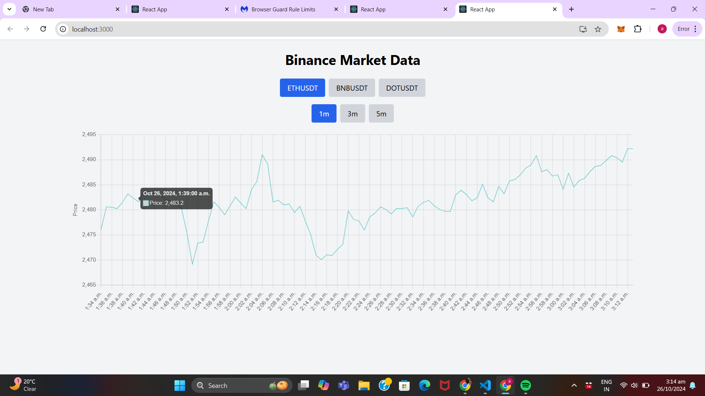

# Binance Market Data WebSocket App

This project is a React-based application that connects to the Binance WebSocket and REST API to display real-time market data for selected cryptocurrencies (ETH/USDT, BNB/USDT, DOT/USDT). It includes features for toggling between different coins, selecting candlestick timeframes, and preserving previous chart data for each coin using local storage.

## Features

- Real-Time Market Data: Uses Binance’s WebSocket to fetch real-time candlestick data for selected cryptocurrencies.
- Candlestick Chart Visualization: Displays live candlestick data in a chart with options for different time intervals (1m, 3m, 5m).
- Coin Toggle: Allows users to toggle between ETH/USDT, BNB/USDT, and DOT/USDT, maintaining each coin’s previous chart data.
- Data Persistence: Stores previous data in local storage to preserve historical chart data for each selected coin.

## Technologies Used

- `React`: JavaScript library for building the user interface.
- `Binance API:` REST and WebSocket APIs for fetching market data.
- `Chart.js: `Library for displaying candlestick charts.
- `Local Storage:` For data persistence, storing previous candlestick data.

## Setup and Installation

Clone the repository:
```bash
git clone <repository-url>
cd <repository-directory>

```

## Install dependencies:

```bash
npm install


```

## Start the development server:

```bash

npm start

```

## Project Structure
- `App.js:` The main component handling state and WebSocket connections.
- `CryptoChart.js:` A component displaying candlestick charts with Chart.js.
- `App.css:` Basic styling for the application.


## Usage
- `Select a cryptocurrency:` Choose between ETH/USDT, BNB/USDT, or DOT/USDT from the dropdown to view the respective candlestick chart.4
- `Change time intervals:` Select between 1-minute, 3-minute, or 5-minute intervals to adjust the chart timeframe.
- `Live Updates:` The chart updates in real-time as new WebSocket data is received from Binance.

## Code Explanation
- `WebSocket Connection:` In App.js, the application connects to the Binance WebSocket API to receive real-time candlestick data for the selected coin and timeframe.

- `Historical Data:` Uses Binance REST API to fetch historical data and populate the chart initially.
- `Data Persistence:` Stores and retrieves data from local storage to maintain chart data for each coin upon switching.


## Screenshot

